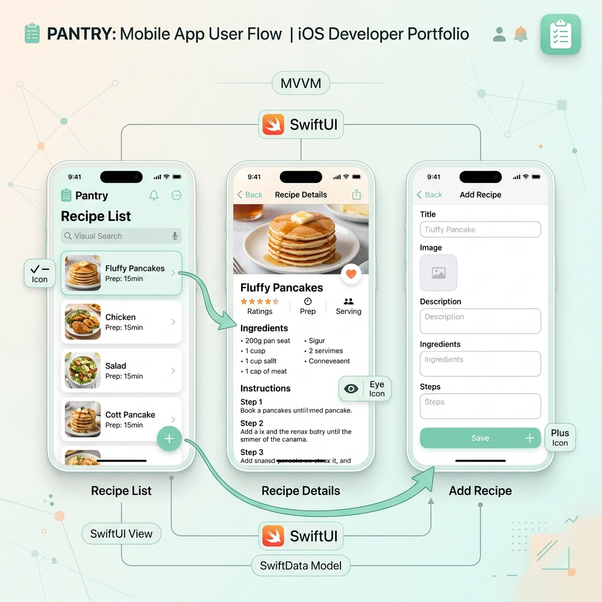
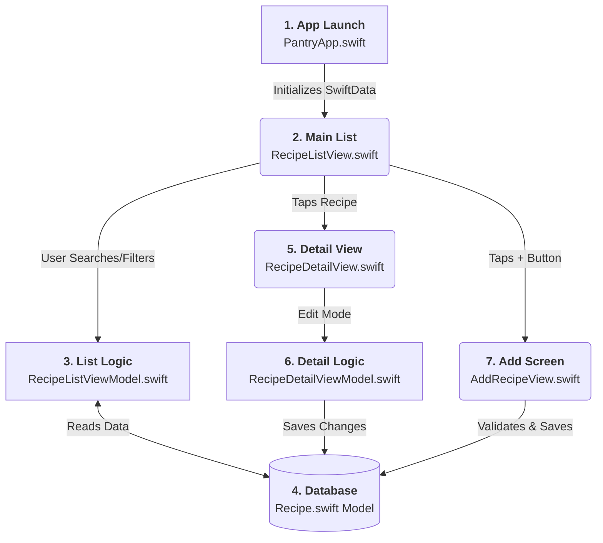

# App Flow & Architecture Guide

This guide provides a "30-second" visual overview of how the Pantry app works, from the moment you open it to saving a recipe.

## Technical Architecture Flow

---

## File Responsibilities

| Layer | File Reference | Responsibility (Layman's Terms) |
| :--- | :--- | :--- |
| **App Root** | [PantryApp.swift](../Pantry/PantryApp.swift) | The "Engine Start" button. Sets up the database. |
| **UI (Screens)** | [RecipeListView.swift](../Pantry/Views/RecipeListView.swift) | The "Home Page". Shows all your recipes and the search bar. |
| | [RecipeDetailView.swift](../Pantry/Views/RecipeDetailView.swift) | The "Read Page". Shows ingredients and cooking steps. |
| | [AddRecipeView.swift](../Pantry/Views/AddRecipeView.swift) | The "Form". Where you type in new recipes. |
| **Logic (Brain)** | [RecipeListViewModel.swift](../Pantry/ViewModels/RecipeListViewModel.swift) | Handles searching and sorting. Decides what to show. |
| | [RecipeDetailViewModel.swift](../Pantry/ViewModels/RecipeDetailViewModel.swift) | Handles "Drafting". Keeps changes temporary until you hit Save. |
| **Data (Store)** | [Recipe.swift](../Pantry/Models/Recipe.swift) | The "Template". Defines what a Recipe is (title, cook time, etc). |
