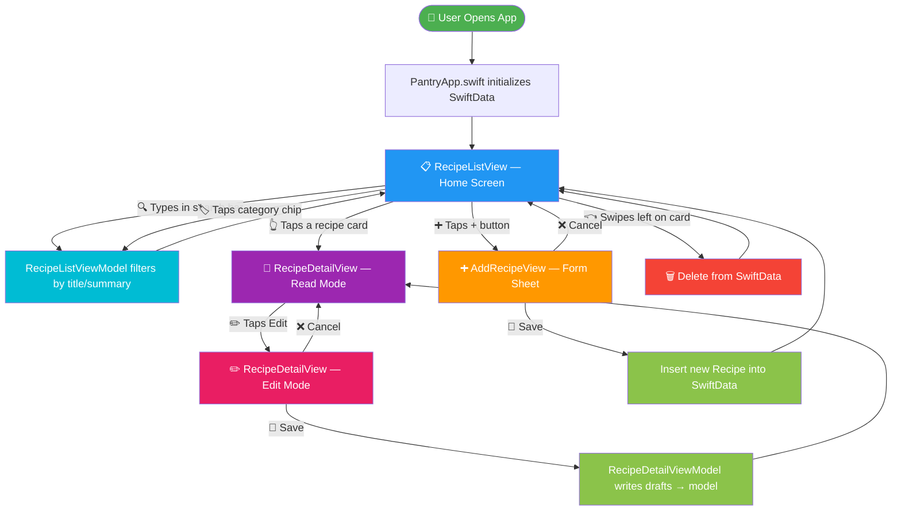
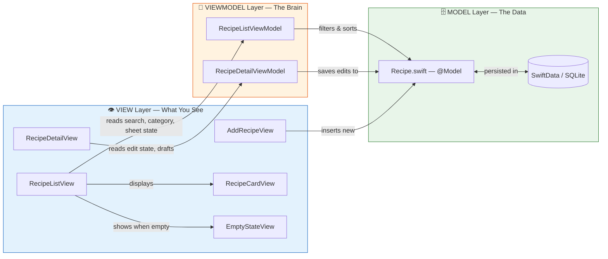
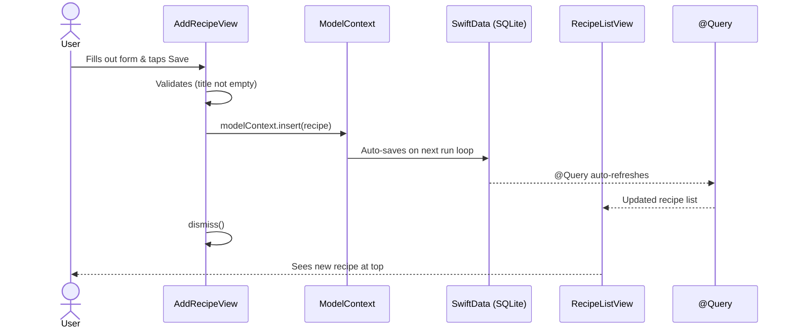
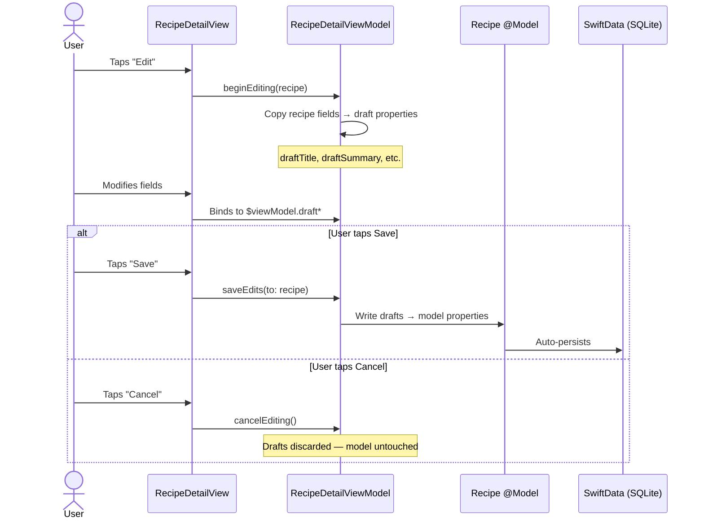

# 🍳 Pantry — App Flow & Architecture Guide

> **Goal**: Understand the entire app in 30 seconds flat.

---

## 1. The 30-Second Overview

Pantry is a **recipe manager** for iOS. You **browse**, **search**, **add**, **edit**, and **delete** recipes — all stored locally on-device via SwiftData (SQLite).

```
┌─────────────────────────────────────────────────────────────────┐
│                        PANTRY APP                               │
│                                                                 │
│   📱 Open App                                                   │
│     │                                                           │
│     ▼                                                           │
│   ┌──────────────────┐     Tap Recipe    ┌──────────────────┐   │
│   │  📋 Recipe List  │ ───────────────▶  │  📖 Recipe Detail│   │
│   │  (Home Screen)   │                   │  (Read / Edit)   │   │
│   │                  │                   │                  │   │
│   │  🔍 Search       │                   │  ✏️ Edit Mode    │   │
│   │  🏷️ Filter       │                   │  💾 Save / ❌    │   │
│   │  🗑️ Swipe Delete │                   │     Cancel       │   │
│   └──────────────────┘                   └──────────────────┘   │
│     │                                                           │
│     │ Tap ➕                                                     │
│     ▼                                                           │
│   ┌──────────────────┐                                          │
│   │  ➕ Add Recipe   │                                          │
│   │  (Form Sheet)    │                                          │
│   │                  │                                          │
│   │  💾 Save → List  │                                          │
│   │  ❌ Cancel → List│                                          │
│   └──────────────────┘                                          │
│                                                                 │
│   ┌─────────────────────────────────────────────────────────┐   │
│   │          🗄️ SwiftData (SQLite on device)                │   │
│   │          Stores all recipes persistently                │   │
│   └─────────────────────────────────────────────────────────┘   │
└─────────────────────────────────────────────────────────────────┘
```

---

## 2. User Journey — Step by Step



---

## 3. MVVM Architecture — How Data Flows



---

## 4. Complete File Map — Every File Explained

### 📁 Project Structure

```
Pantry/
├── Pantry.xcodeproj/              ← Xcode project config
├── Pantry/                        ← 📦 Main App Source
│   ├── PantryApp.swift            ← 🚀 Entry point
│   ├── Models/
│   │   └── Recipe.swift           ← 🗄️ Data model
│   ├── ViewModels/
│   │   ├── RecipeListViewModel.swift    ← 🧠 List logic
│   │   └── RecipeDetailViewModel.swift  ← 🧠 Detail/edit logic
│   ├── Views/
│   │   ├── RecipeListView.swift         ← 📋 Home screen
│   │   ├── RecipeDetailView.swift       ← 📖 Detail screen
│   │   ├── AddRecipeView.swift          ← ➕ Add recipe form
│   │   └── Components/
│   │       ├── RecipeCardView.swift      ← 🃏 List row card
│   │       ├── EmptyStateView.swift      ← 🕳️ Empty placeholder
│   │       └── AutoSizingTextEditor.swift← 📝 Expanding input
│   └── Assets.xcassets/           ← 🎨 App icons & colors
├── PantryTests/
│   └── PantryTests.swift          ← 🧪 Unit tests
├── PantryUITests/
│   ├── PantryUITests.swift        ← 🤖 UI tests
│   └── PantryUITestsLaunchTests.swift ← 🚀 Launch tests
└── Docs/                          ← 📚 Documentation
    ├── FLOW.md                    ← (this file)
    ├── ARCHITECTURE.md
    ├── Skills.md
    ├── README.md
    ├── AI_LOG.md
    └── REVIEW_LOG.md
```

---

## 5. File → Responsibility → User Action Map

| # | File | Layer | What It Does (Layman) | User Action |
|:--|:-----|:------|:---------------------|:------------|
| 1 | [PantryApp.swift](../Pantry/PantryApp.swift) | 🚀 **App Root** | Starts the app, boots up the database | _Opens the app_ |
| 2 | [Recipe.swift](../Pantry/Models/Recipe.swift) | 🗄️ **Data Model** | Defines what a recipe _is_ — title, cook time, ingredients, steps, emoji, category. Also has sample data for previews. | _Every action_ |
| 3 | [RecipeListView.swift](../Pantry/Views/RecipeListView.swift) | 👁️ **Screen** | Home page — shows recipe cards, search bar, category filter chips, + button, and handles navigation | _Browses recipes_ |
| 4 | [RecipeListViewModel.swift](../Pantry/ViewModels/RecipeListViewModel.swift) | 🧠 **Logic** | Filters recipes by search text & category, handles delete operations | _Searches or filters_ |
| 5 | [RecipeDetailView.swift](../Pantry/Views/RecipeDetailView.swift) | 👁️ **Screen** | Shows full recipe — emoji hero, ingredients list, numbered steps. Switches to edit form when editing | _Reads a recipe_ |
| 6 | [RecipeDetailViewModel.swift](../Pantry/ViewModels/RecipeDetailViewModel.swift) | 🧠 **Logic** | "Draft Pattern" — copies recipe fields to temporary state for editing. Only saves when user confirms | _Edits a recipe_ |
| 7 | [AddRecipeView.swift](../Pantry/Views/AddRecipeView.swift) | 👁️ **Screen** | Modal form with emoji picker, category dropdown, cook time stepper, and text areas for ingredients/steps | _Creates a recipe_ |
| 8 | [RecipeCardView.swift](../Pantry/Views/Components/RecipeCardView.swift) | 🧩 **Component** | A single row card in the list — emoji circle, title, summary, cook time & category badges | _Sees a recipe in the list_ |
| 9 | [EmptyStateView.swift](../Pantry/Views/Components/EmptyStateView.swift) | 🧩 **Component** | Friendly placeholder when there are no recipes or search returns nothing | _First launch / empty search_ |
| 10 | [AutoSizingTextEditor.swift](../Pantry/Views/Components/AutoSizingTextEditor.swift) | 🧩 **Component** | Text field that grows as you type (1–6 lines) | _Types a long summary_ |
| 11 | [PantryTests.swift](../PantryTests/PantryTests.swift) | 🧪 **Test** | Unit tests for model creation, filtering, cook time formatting, delete operations | _Developer runs tests_ |
| 12 | [PantryUITests.swift](../PantryUITests/PantryUITests.swift) | 🤖 **Test** | End-to-end UI tests via XCUIApplication | _CI/CD pipeline_ |

---

## 6. Data Flow — How a Recipe Gets Created



---

## 7. Data Flow — How Editing Works (Draft Pattern)



---

## 8. Tech Stack Quick Reference

| Aspect | Technology | Why |
|:-------|:-----------|:----|
| **Language** | Swift 5.10+ | Modern, type-safe |
| **UI Framework** | SwiftUI | Declarative, less code |
| **Persistence** | SwiftData (iOS 17+) | Zero-boilerplate SQLite |
| **Architecture** | MVVM + `@Observable` | Clean separation, testable |
| **Navigation** | `NavigationStack` + typed links | Type-safe routing |
| **State** | `@State`, `@Query`, `@Environment` | SwiftUI-native reactivity |
| **Min Target** | iOS 17.0 | SwiftData requirement |

---

## 9. Key Design Patterns

### 🔄 Draft Pattern (Edit Safety)
> Editing never touches the real data until you hit Save. If you cancel, nothing changes.
>
> **File**: [RecipeDetailViewModel.swift](../Pantry/ViewModels/RecipeDetailViewModel.swift)

### 📝 Newline-Separated Storage
> Ingredients and steps are stored as a single `String` with `\n` separators. Parsed into arrays via computed properties. Simpler than relationships.
>
> **File**: [Recipe.swift](../Pantry/Models/Recipe.swift) — `ingredientsRaw` / `stepsRaw`

### 🏷️ Static Category Filter
> Category chips sit _above_ the List (not inside it) for better scroll performance.
>
> **File**: [RecipeListView.swift](../Pantry/Views/RecipeListView.swift) — `categoryFilterSection`

### 🧩 Pure Display Components
> `RecipeCardView` and `EmptyStateView` have zero business logic — they just render data.
>
> **Files**: [RecipeCardView.swift](../Pantry/Views/Components/RecipeCardView.swift), [EmptyStateView.swift](../Pantry/Views/Components/EmptyStateView.swift)
